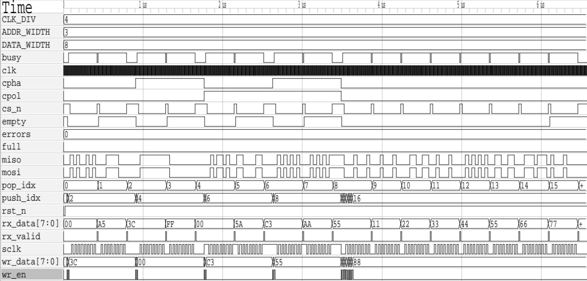

# SPI Master Controller with FIFO Buffer Integration

## Overview

This project implements a parameterized Serial Peripheral Interface (SPI) Master Controller integrated with a synchronous circular FIFO buffer using synthesizable Verilog HDL. The design supports all four standard SPI operating modes through run-time configurable Clock Polarity (CPOL) and Clock Phase (CPHA) signals. A dedicated FIFO-to-SPI scheduling mechanism enables continuous burst transfers while preventing synchronization hazards caused by registered FIFO outputs.

The system is composed of three major modules:

* SPI Protocol Engine (`core.v`)
* Circular FIFO Buffer (`fifo.v`)
* Top-Level Scheduler (`top.v`)

The design was developed with emphasis on modularity, protocol correctness, timing robustness, and reusability for FPGA-based embedded systems.

---

# 1. Introduction

Serial Peripheral Interface (SPI) is one of the most widely used synchronous serial communication protocols in embedded systems. It provides full-duplex communication between a master device and one or more slave devices using four signals:

* SCLK (Serial Clock)
* MOSI (Master Out Slave In)
* MISO (Master In Slave Out)
* CS_N (Chip Select)

Although SPI is conceptually simple, practical implementations must correctly handle clock phase variations, clock polarity variations, setup and hold timing requirements, and continuous burst transfers.

The objective of this project was to design a reusable SPI Master IP core capable of:

* Supporting all four SPI modes
* Handling continuous burst transfers
* Providing transmit buffering through FIFO storage
* Preventing synchronization hazards
* Remaining fully synthesizable and portable

---

# 2. Design Objectives

The project was designed with the following objectives:

1. Implement a configurable SPI Master supporting Modes 0–3.
2. Provide programmable SPI clock generation.
3. Support run-time protocol switching through CPOL and CPHA control signals.
4. Implement a synchronous FIFO for burst transmission support.
5. Eliminate race conditions between FIFO and SPI subsystems.
6. Verify functionality using self-checking testbenches.
7. Create a reusable communication IP suitable for FPGA deployment.

---

# 3. System Architecture

The complete system consists of three interconnected modules.

```txt
                    +---------------------------------------+                  
                    |                  top                  |                  
                    |                                       |                  
+----------+        |  +----------+           +----------+  |       +---------+
|          | Write  |  |          | Read Data |          |  | SCLK  |         |
|          |------->|  |          |---------->|          |  |------>|         |
| Host/CPU |        |  |   fifo   |           |   core   |  | MOSI  |         |
|          | Status |  |          | Pop/Start |          |  |------>|   SPI   |
|          |<-------|  |          |<----------|          |  | MISO  |  Slave  |
+----------+        |  +----------+           +----------+  |<------|         |
                    |                                       | CS_N  |         |
                    |                                       |------>|         |
                    +---------------------------------------+       +---------+
```

### FIFO Buffer

The FIFO acts as a temporary storage element for outgoing transactions generated by the host system.

### SPI Core

The SPI Core performs serial transmission and reception while generating all protocol timing signals.

### Top-Level Scheduler

The scheduler coordinates FIFO reads and SPI transaction initiation while maintaining safe timing relationships between modules.

Data written by the host is first stored in the FIFO. Whenever the SPI engine becomes idle and valid data is available, the scheduler initiates a FIFO read operation and subsequently launches a new SPI transaction.

---

# 4. FIFO Buffer Design

## 4.1 Motivation

SPI transactions occur serially, while processors typically generate data in parallel bursts. To decouple these two rates, a buffering mechanism is required.

A synchronous circular FIFO was chosen because it:

* Supports burst traffic
* Reduces processor wait time
* Simplifies transaction scheduling
* Provides deterministic behavior

---

## 4.2 Circular Buffer Structure

The FIFO depth is parameterized as:

```
DEPTH = 2^ADDR_WIDTH
```

The design uses:

* Memory array
* Read pointer
* Write pointer

Instead of maintaining an occupancy counter, status flags are derived directly from pointer relationships.

---

## 4.3 Empty Detection

The FIFO is empty whenever:

```
rd_ptr == wr_ptr
```

This condition indicates that no unread entries exist within the buffer.

---

## 4.4 Full Detection

Both pointers are extended by one additional MSB.

The FIFO is considered full when:

```
rd_ptr[MSB] != wr_ptr[MSB]
AND
rd_ptr[ADDR_WIDTH-1:0] ==
wr_ptr[ADDR_WIDTH-1:0]
```

The additional MSB acts as a wrap-around indicator and allows reliable distinction between Full and Empty states.

---

## 4.5 Registered Read Output

The FIFO output is registered.

Advantages include:

* Reduced combinational delay
* Improved timing closure
* Cleaner synthesis results
* Better scalability at higher clock frequencies

The registered output introduces a one-cycle read latency, which is handled explicitly by the scheduler.

---

# 5. SPI Core Design

## 5.1 SPI Modes

The SPI protocol supports four standard operating modes.

| Mode | CPOL | CPHA |
| ---- | ---- | ---- |
| 0    | 0    | 0    |
| 1    | 0    | 1    |
| 2    | 1    | 0    |
| 3    | 1    | 1    |

Rather than implementing separate state machines for each mode, the design dynamically computes sampling and shifting events using CPHA.

This significantly reduces hardware complexity.

---

## 5.2 Clock Generation

The SPI clock is generated from the system clock through a programmable divider.

```
f_SCLK = f_CLK / CLK_DIV
```

This allows the same design to interface with peripherals operating at different communication speeds.

---

## 5.3 Finite State Machine

The SPI engine is implemented as a three-state FSM.

### IDLE

In this state:

* CS_N remains deasserted
* SCLK remains at CPOL level
* No transaction is active

The controller waits for a start signal.

---

### ACTIVE

During ACTIVE state:

* SCLK toggles according to CLK_DIV
* MOSI data is transmitted
* MISO data is sampled
* Shift and sample operations occur according to CPHA

The state continues until all bits have been transferred.

---

### DONE

After the final bit transfer:

* A hold-time guard interval is enforced
* CS_N remains asserted
* Final received data is committed

Once the guard interval expires, the controller returns to IDLE.

---

# 6. CPOL and CPHA Handling

A key design objective was supporting all SPI modes using a unified architecture.

Sampling and shifting events are determined from the clock-edge counter.

For CPHA = 0:

* Data is sampled on the first edge
* Data is shifted on the second edge

For CPHA = 1:

* Data is shifted on the first edge
* Data is sampled on the second edge

This approach allows dynamic protocol switching without requiring reconfiguration or multiple FSM implementations.

---

# 7. Setup and Hold-Time Protection

Correct timing at the physical interface is critical.

## First-Bit Setup Time

For CPHA = 0 operation, the slave samples data on the very first clock edge.

Therefore the SPI core preloads the MSB onto MOSI before the first clock transition occurs.

This guarantees sufficient setup time.

---

## Chip Select Hold Margin

A common design error is releasing CS_N immediately after the final clock edge.

Some slave devices require additional hold time after the last sampled bit.

To prevent timing violations, the controller remains in the DONE state for an additional half-SCLK interval before deasserting CS_N.

This provides a deterministic hold-time margin.

---

# 8. FIFO-SPI Handshake Logic

The most important architectural challenge is the synchronization of FIFO reads with SPI transactions.

Because the FIFO output is registered:

* FIFO read request occurs in Cycle N
* Valid read data appears in Cycle N+1

Directly launching the SPI core in Cycle N would therefore transmit invalid data.

To solve this problem, the scheduler implements a one-cycle pipeline delay.

### Transaction Sequence

Cycle N:

* FIFO read asserted

Cycle N+1:

* FIFO output becomes valid

Cycle N+1:

* SPI start signal asserted

Cycle N+2:

* SPI transmission begins

This guarantees correct operation without introducing combinational timing paths.

---

# 9. Verification Methodology

A self-checking testbench was developed to validate the complete system.

The SPI interface was configured in loopback mode:

```
assign miso = mosi;
```

This allows transmitted data to be received back internally.

---

## Test Categories

### SPI Mode Validation

The controller was tested under:

* Mode 0
* Mode 1
* Mode 2
* Mode 3

to verify protocol correctness across all CPOL/CPHA combinations.

---

### FIFO Boundary Testing

Verification included:

* Empty condition
* Full condition
* Pointer wrap-around
* Continuous push operations

---

### Burst Transfer Testing

Continuous writes were issued to verify:

* FIFO buffering
* Scheduler operation
* Back-to-back transaction execution

---

### Self-Checking Infrastructure

The testbench maintains a software-side expected queue.

Whenever RX_VALID is asserted:

1. Received data is captured.
2. Expected data is retrieved.
3. Automatic comparison is performed.
4. Errors are recorded.

This enables unattended verification.

---

# 10. Simulation Results

Simulation was performed using:

* Icarus Verilog
* GTKWave

The waveform confirms:

* Correct SCLK generation
* Proper CS_N timing
* Accurate MOSI/MISO behavior
* Successful FIFO operation
* Proper pointer advancement
* Correct reception of transmitted bytes

Verification vectors included:

```
A5
3C
FF
00
5A
C3
AA
55
11
22
33
44
55
66
77
88
```

All transmitted values were successfully received through loopback testing.

The final verification summary reported:

```
ALL TESTS PASSED
0 ERRORS
```

No protocol violations, timing errors, or FIFO synchronization issues were observed.



---

# 11. Resource Optimization Features

Several implementation choices were made to improve efficiency.

### Pointer-Based FIFO Tracking

Avoids occupancy counters and associated arithmetic hardware.

### Parameterized Widths

Supports multiple data widths and FIFO depths without code modification.

### Dynamic Protocol Configuration

Allows mode switching at run time rather than synthesis time.

### Registered Data Paths

Improves timing closure and reduces combinational path lengths.

---

# 12. Future Improvements

Possible extensions include:

* Multi-slave support
* AXI-Lite or APB interface integration
* Interrupt generation
* Dual-clock asynchronous FIFO
* Configurable frame sizes beyond 8 bits
* Error-checking support

---

# 13. Conclusion

A parameterized SPI Master Controller with integrated FIFO buffering was successfully designed and verified using Verilog HDL.

The design supports all four SPI modes, programmable clock generation, burst transfers, and dynamic protocol reconfiguration while maintaining protocol timing correctness. The implementation employs a pointer-based circular FIFO, a robust SPI finite state machine, and a deterministic scheduling mechanism to eliminate synchronization hazards.

Comprehensive simulation-based verification demonstrated successful operation under normal and stress-test conditions, with all test cases passing without errors. The resulting architecture is synthesizable, reusable, and suitable for deployment in FPGA-based embedded communication systems.
